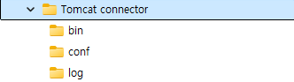

# Tomcat-Tomcat connector-IIS


## 목차

- **사전 요구 사항 및 환경 설정**
  - Tomcat과 IIS의 버전 정보.
  - 폴더에 필요한 권한 설정
- **Tomcat Connector 설치**
  - 설치 파일 준비
  - 각 파일의 설명 및 역할
  - 필요한 권한 부여
  - IIS 설정
  - 주의 사항
- **설정 방법**
  - 설정하는 이유 및 설정의 의미 설명.
  - server.xml 설정
  - [workers.properties](http://workers.properties) 설정
  - [uriworkermap.properties](http://uriworkermap.properties) 설정
  - pc 자체에서 설정해야 하는 것.
  - 주의사항
- **발생 가능한 오류**
  - 확인 가능한 로그 및 가용 포트 확인 방법
  - 각 오류에 따른 해결 방안.
  - 해결이 안될 시 추가 추천 방안.
- **동작 방식**
  - Tomcat-IIS 연동 방식 설명 (예: AJP 연결 방식).
- **예외**

## 사전 요구 사항 및 환경 설정


### Tomcat과 IIS 정보

- IIS
  - Window version : Window Server 2019
  - Version : 1809 (OS build: 17763.3650)
- Tomcat
  - Java version: 17
  - Tomcat version: 10.1.30
  - Tomcat connector version: 1.2.50-windows-x86_64

### 폴더에 필요한 권한 설정

- Tomcat
  - webapps 선택 후 alt + enter> 보안 탭> 그룹 또는 사용자 이름의 편집> 추가> 고급>  지금 찾기> ANONYMOUS LOGON, IUSR, IIS-IUSRS 추가. (IUSER, IIS-IUSRS는 무조건 추가하는 것을 권장)> 이름 확인> 확인> 적용.
  - 위의 권한 부여는 webapps와 같은 .war file에 접근해야 하는 폴더에 모두 해야 한다.
  - 필요할 경우 tomcat> conf> server.xml, context.xml에 권한을 부여해야 할 수도 있다. 필요할 경우 부여.
- Tomcat connector
  - bin> .dll file 선택 후 alt + enter> 보안 탭> 그룹 또는 사용자 이름의 편집> 추가> 고급>  지금 찾기> ANONYMOUS LOGON, IUSR, IIS-IUSRS 추가. (IUSER, IIS-IUSRS는 무조건 추가하는 것을 권장)> 이름 확인> 확인> 적용.

## Tomcat connector 설치


### **설치 파일 준비**

- isapi_redirect.dll: Tomcat과 IIS 간의 통신을 지원하는 핵심 파일.
- workers.properties: IIS 요청을 특정 Tomcat 인스턴스로 전달하기 위한 매핑 정보를 설정하는 파일.
- uriworkermap.properties: 요청 URL과 worker간의 매핑을 정의하는 파일.
- isapi_redirect.properties: Tomcat Connector 설정을 저장하는 파일.
- Tomcat connector 폴더 구조

  

- bin

         |- isapi_redirect.dll

         └ isapi_redirect.properties

- conf

         |- workers.properteis

         └ uriworkermap.properties

- log

         └ isapi_redirect.log (동작 시 자동 생성. 만들 필요 X)

### 각 파일의 설명 및 역할

- isapi_redirect.dll
  - IIS와 Tomcat 간의 브릿지 역할을 담당하는 주된 모듈
  - IIS가 이 파일을 통해 Tomcat의 worker와 통신한다.
  - [Apache Tomcat Connectors 다운로드 페이지](https://tomcat.apache.org/download-connectors.cgi)에서 다운로드 받을 수 있다.
    - Tomcat connector JK 1.2 하위의 Binary Release for selected versions 선택
    - windows/ 폴더 선택.
    - Tomcat connector 1.2.50  버전 중, 각 window 환경에 맞는 설치 파일 다운로드.
- isapi_redirect.properties
  - Tomcat connector의 설정을 관리.
  - IIS와 Tomcat 간의 연결 동작을 구체적으로 제어하는 역할을 한다.

    ```
    extension_uri=/jakarta/isapi_redirect.dll
    
    log_file=C:/util/Tomcat connector/log 
    (tomcat connector가 설치된 폴더 내의 log 폴더를 지정)
    
    log_level=info
    
    worker_file=C:/util/Tomcat connector/conf/workers.properties
    (tomcat connector가 설치된 폴더 내의 conf/workers 설정 파일 지정.)
    
    worker_mount_file=C:/util/Tomcat connector/conf/uriworkermap.properties
    (tomcat connector가 설치된 폴더 내의 conf/uriworkermap 설정 파일 지정.)
    ```

- workers.properties.
  - 여러 worker설정을 정의하여 특정 Tomcat 인스턴스로 요청을 전달할 수 있도록 매핑
  - 주로 AJP 프로토콜 및 포트를 지정.

    ```
    worker.list=worker1
    (`,`로 구분 가능. ex: worker1, worker2, ...etc)
    
    worker.worker1.type=ajp13
    (보통 ajp13 protocol 고정)
    
    worker.worker1.host=localhost
    (**tomcat의 conf/server.xml과 맞춰야 한다.**)
    
    worker.worker1.port=8010
    (**tomcat의 conf/server.xml과 맞춰야 한다.**)
    
    worker.worker1.lbfactor=1
    ( Apache Tomcat과 IIS 간의 로드 밸런싱을 설정하는 항목)
    ```

- uriworkermap.properties
  - URI 패턴을 정의하여 각 패턴이 특정 worker로 라우팅 되도록 한다.
  - /* = worker1일 경우, 모든 요청은 worker1 thread가 처리한다.

    ```
    /*=worker1
    (모든 요청은 worker1 thread로 처리하겠다.)
    
    /{your.uri.mapping}/*=worker1
    (사용자가 설정한 uri로 오는 요청은 worker1 thread로 처리하겠다.)
    (workers 설정의 우선 순위는 범위가 좁은 설정 -> 넓은 설정 순.)
    ```


### 필요한 권한 부여

- isapi_redirect.dll에 대한 접근 권한.
  - isapi_redirect.dll 파일은 IIS에서 로드하는 파일이므로, 이 파일이 포함된 /bin 폴더는 IUSR, IIS-IUSRS 계정의 권한이 필수적이다.
  - 설정 방법:
    1. bin folder 선택 후 alt + enter> 보안 탭>
    2. 그룹 또는 사용자 이름의 편집> 추가> 고급>  지금 찾기>
    3. ANONYMOUS LOGON, IUSR, IIS-IUSRS 추가. (IUSER, IIS-IUSRS는 무조건 권한을 부여하는 것을 권장한다.)>이름 확인> 확인> 적용.

### IIS 설정

- IIS 관리 도구에서 ISAPI 및 CGI 제한> isapi_redirect.dll 파일 추가. 설명은 Tomcat으로 작성 후, 확인. 확장 경로 실행 허용 체크 후, 허용 상태로 설정.
- Tomcat과 연동할 특정 웹 사이트 선택. ISAPI 필터로 isapi_redirect.dll 파일 추가. 필터 이름은 Tomcat.
- 특정 웹 사이트 좌클릭>가상 디렉토리 추가>별칭은 jakarta(isapi_redirect.properties에서 설정한 이름과 동일해야 한다.) 실제 경로는 isapi_redirect.dll 파일이 위치하는 폴더로 지정.
- 선택한 웹 사이트에서 처리기 매핑 선택. ISAPI-dll 선택. 우측의 <기능 사용 권한 편집…> 선택. 실행 선택 후 확인.
  - 적용 한다면 CGI-exe도 동시에 사용 상태로 변경 될 것. 만약 변경이 안된다면, 수동으로 동일하게 처리 요망.
- 이후 IIS 전체 재시작. (window Service>Would Wide Web Publishing 서비스 재시작)

### 주의 사항

- 가상 디렉토리 폴더 설정은 isapi_redirect.properties에서 설정한 이름과 일치해야 한다.
- Tomcat connector/bin 폴더에 내의 파일에 수정 사항이 생겼을 경우, 혹은 IIS에서 bin 폴더와 연동하는 부분에 수정 사항이 있을 경우 IIS를 재시작 해야 수정 사항이 적용이 된다.
- dll 파일의 위치가 올바른 위치에 있지 않을 경우, IIS가 이를 찾지 못한다.

## 설정 방법


### 설정하는 이유 및 설정의 의미

- IIS와 Tomcat을 연동하는 이유는 두 서버 각각의 장점을 사용하기 위해서이다.
- IIS는 정적 콘텐츠 처리에 뛰어나고, Tomcat은 동적 콘텐츠를 처리하는 데 적합하다. 이 설정을 통해 IIS는 정적 리소스를 직접 처리하고, AJP를 사용하여 필요한 요청을 Tomcat으로 전달. 동적 처리 기능을 향상시킬 수 있다.

### server.xml 설정.

- 역할: server.xml 파일은 Tomcat의 주요 파일 중 하나. AJP Connector 설정을 통해 IIS와 연결을 설정한다
- 설정 예시:

```xml
<Connector protocol="AJP/1.3" 
	address="127.0.0.1" 
	port="8010" 
	redirectPort="8443" />
```

- protocol: AJP/1.3을 사용하여 IIS와 Tomcat 간 통신을 설정한다.
- address: 127.0.0.1로 설정하여 localhost 연결을 보장한다. server.xml 파일의 설정은 workers.properties와 일치해야 한다.
- port: workers.properties file의 port 값과 동일하게 설정되어야 한다.

### workers.properties 설정

- 역할: 여러 Tomcat worker 설정을 정의하고 AJP를 통해 특정 worker에 요청을 라우팅한다.
- 설정 예시:

``` xml
worker.list=worker1
worker.worker1.type=ajp13
worker.worker1.host=127.0.0.1
worker.worker1.port=8010
worker.worker1.lbfactor=1
```

- worker.list: 사용할 worker 목록을 나열한다. ex: worker1, worker2
- worker.{workerName}.type: ajp13을 사용해 AJP로 설정한다.
- worker.{workerName}.host: server.xml의 address와 일치하게 설정한다.
- worker.{workerName}.port: server.xml의 AJP 포트와 동일하게 설정한다.
- worker.{workerName}.lbfactor: 로드 밸런싱을 위한 값. 기본적으로 1로 설정하여 균등 분배를 지정한다.

### uriworkermap.properties 설정.

- 역할: URL 패턴을 정의하고, 특정 요청이 어떤 worker로 전달이 될 지를 지정하여 요청을 세밀하게 라우팅 할 수 있다.
- 설정 예시:

``` xml
/app1/*=worker1
/*=worker1
```

- /*=worker1: 모든 요청을 worker1로 라우팅한다.
- /app1/*=worker1: /app1 하위 경로의 요청은 worker1로 라우팅한다.
- 일반적으로 범위가 좁은 URI가 우선 적용된다.

### PC 자체에서 설정해야 하는 것.

- 역할: local에서 도메인 이름으로 {yourDomain}에 접근하도록 설정하여, 각 요청이 정확한 호스트로 전달되게 한다. (꼭 필요한 설정인지는 검증하지 못했다. 검증 필요.)
- C:\Windows\System32\drivers\etc\hosts 파일에 설정을 추가해야 한다.
  - {address} {domainName}
  - 설정 예시:

    ``` xml
    127.0.0.1 example.com
    ```


### 주의사항

- port, host 일치: workers.properties와 server.xml의 AJP 포트 설정 및 host 설정이 정확히 일치해야 한다.
- 파일 경로: isapi_redirect.properties 파일 내의 경로 설정이 정확한지 확인해야 한다. 잘못된 경로는 실패의 원인이 된다.
- 캐시 관리: IIS와 Tomcat 및 web site의 캐시가 이전 설정을 유지할 수 있다. 설정 변경 후 Tomcat과 설정이 변경된 IIS site는 재시작 하는 것이 중요하며, 접속을 시도했던 web site의 검색 기록 및 캐시는 지우는 것 또한 중요하다.
  - 웹 사이트 캐시 삭제 → IIS 재시작 → Tomcat 재시작

## 발생 가능한 오류


### 확인 가능한 로그 및 가용 포트 확인 방법

- 문제 발생 시 참고할 로그 파일 위치.
  - C:\inethub\logs\LogFiles\{logType}{siteNum} → iis log
  - Tomcat connector\log\isapi_redirect.log → tomcat connector log
  - Apache Software Foundation\logs\catalina{localDateTime}.log, localhost_access_log.{localDateTime}.txt, tomcat{tomcat version}-stdout.{localDateTime}.log

    → 각각 Tomcat 동작 시, Client의 요청에 대한 응답 상태.(Http status), Java application log.

- 가용 포트 확인 방법
  - Window 기준: netstat -ano | find “{portNum}”
  - mac 기준: lsof - i :{portNum} or netstat -an | grep {portNum}

### 각 오류에 대한 해결 방안

- 확인된 오류 목록
  1. java application 화면이 아닌, directory가 나오는 경우
  2. Service Temporarily Unavailable 웹 페이지가 반환되는 경우.
  3. 404 Not Found가 발생하는 경우.
  4. 디렉토리에 대한 접근 권한이 없다는 화면이 나올 경우.
  5. 글자가 깨져서 “꿽” 뭐 이런 글자가 나오는 경우.
  6. 500 Internal Server Error
  7. 403 Forbidden
  8. Connection Refused
  9. 캐시 이슈로 인한 이상 동작.

- 각 오류 번호 별 원인
  1. 접근한 uri가 tomcat connector의 uriworkermap에서 설정한 uri의 규칙과 일치하지 않으며, IIS 설정 중, 디렉토리 검색을 사용하는 경우 발생.
  2. Tomcat Connector와 Tomcat의 연결에 실패할 경우 발생. IIS와 Tomcat connector의 연결에는 성공한 상태.
  3. Java application Request Mapping의 규칙에 알맞지 않게 요청을 보낸 경우 발생. Tomcat connector, Tomcat, IIS와는 연결되어 있다.
  4. 1번과 동일하나, IIS 설정 중, 디렉토리 검색을 사용하지 않을 경우 발생한다.
  5. 2번과 동일한 이유다. 인코딩이 일치하지 않아서 글자가 깨지는 것,
  6. 설정 파일 중 오탈자가 있거나, 구성이 잘못될 경우 발생, (포트 번호, 프로토콜 불일치 등)
  7. Tomcat 또는 IIS의 특정 파일에 접근 권한이 없을 경우 발생. 보통 webapps, isapi_redirect.dll 파일에서 자주 발생한다.
  8. AJP 포트가 바인딩이 되지 않았거나, 잘못된 포트로 연결을 시도할 경우 발생한다.
  9. IIS나 Tomcat, Tomcat connector 중 변경 사항이 반영되지 않은 경우 발생한다.

- 각 오류 별 해결 방안
  1. uriworkermap.properties의 규칙을 변경하거나, java application Request Mapping을 uriworkermap.properties의 규칙에 맞게 변경. 테스트 용도라면 “/*”을 사용해서 모든 요청을 받는 것도 괜찮다.
  2. Tomcat server.xml의 AJP 설정 부분과, Tomcat Connector worker.properties 설정 파일을 일치하게 수정. host = address port=port. secretRequired=”false” 추가 만약 주석 처리 (<!—, —>)가 있을 경우, 제거.
  3. Java application Request Mapping의 규칙에 맞게 요청을 보내는 것을 권장.
  4. 1번과 동일하다.
  5. 2번과 동일하다.
  6. 각 설정 파일에 오타가 있는지 확인. 포트 번호, protocol이 일치하는지 재검증하는 것을 추천한다.
  7. Tomcat의 webapps 폴더, Tomcat connector의 bin/isapi_redirect.dll 파일에 권한을 부여했는지 확인. 만약 없다면, [여기](https://github.com/chanhwiim/Document/blob/main/doc/Tomcat%20Connecotr%2C%20Tomcat%2C%20IIS.md#%ED%8F%B4%EB%8D%94%EC%97%90-%ED%95%84%EC%9A%94%ED%95%9C-%EA%B6%8C%ED%95%9C-%EC%84%A4%EC%A0%95)를 눌러 권한 부여 방법 확인 및 적용 권장.
  8. terminal을 열어서, 포트가 열려 있는 상황인지, Tomcat server.xml에서 설정한 address로 포트가 열려 있는지, 상태가 listening인지 확인.  가용 가능한 포트인지 확인하는 방법은 [여기](https://github.com/chanhwiim/Document/blob/main/doc/Tomcat%20Connecotr%2C%20Tomcat%2C%20IIS.md#%ED%99%95%EC%9D%B8-%EA%B0%80%EB%8A%A5%ED%95%9C-%EB%A1%9C%EA%B7%B8-%EB%B0%8F-%EA%B0%80%EC%9A%A9-%ED%8F%AC%ED%8A%B8-%ED%99%95%EC%9D%B8-%EB%B0%A9%EB%B2%95)를 눌러 포트를 확인하는 방법 적용 권장.
  9. IIS의 웹 사이트(IIS 전체를 재시작 할 필요 없다.)를 재시작 후, Service에서 Tomcat(Apache Tomcat {Tomcat version} {your Tomcat setting Name})을 재시작. 웹 사이트의 캐시 및 기록을 지우고 다시 시도하는 것을 권장한다. 순서는 관련 없다.
    - 웹 사이트 캐시 삭제 → IIS 재시작 → Tomcat 재시작

### 해결이 안될 시 추가 추천 방안.

필자가 경험한 오류들은 위와 같다. 만약 다른 오류가 발생하거나, 해결이 안될 경우에는 log를  확인하고, 설정 파일이 일치 하는지 확인. 재검토. 캐시 문제인지 확인하는 것을 권장한다. 개인 local pc인 경우에는 pc를 재부팅 하는 것도 괜찮다.

필자는 Tomcat connector/bin/isapi_redirect.properties 설정 중 log level=debug로 내려서 확인했었다. 실제 서비스에서는 info로 하는 것을 추천하나, 테스트 및 구현 단계에서는 로그 레벨을 내려서 확인하는 것도 좋은 방법이라 생각한다.

workers.properties 파일의 설정. 특히 host에 관한 설정과, server.xml의 AJP address가 일치하는지 검토하기 바란다.

## **동작 방식**


### Tomcat-IIS 연동 방식 설명

- Tomcat과 IIS의 연동은 주로 AJP(Apache JServer Protocol) 방식을 사용하여 이루어진다. AJP는 HTTP보다 가벼운 프로토콜로, 웹 서버와 서블릿 엔진 간의 효율적인 데이터 교환을 위해 설계되었다. 이 연동 방식은 IIS에서 처리된 클라이언트의 요청을 AJP를 통해 Tomcat으로 전달되며, Java 기반의 동적 웹 콘텐츠를 제공하는 방식.
- Client - IIS - AJP(Tomcat connector) - Java web page

  이 순서를 조금 더 자세하게 설명하면

- Client → IIS (HTTP 요청 수신) → isapi_redirect.dll (AJP로 변환) → Tomcat(Java web page 처리) → IIS (HTTP 응답 변환) → Client
- 전체 연동 예시 및 동작 방식.

  각 파일(Tomcat의 server.xml, Tomcat connector의 workers.properties, uriworkermap.properties)의 설정을 예시로 설명한다.

- Tomcat server.xml에 위와 같은 설정이 있다고 가정한다.

```xml
<Connector protocol="AJP/1.3" 
	address="127.0.0.1" 
	port="8010" 
	redirectPort="8443" />
```

- 그리고 worker.properties에는 위와 같은 설정이 있다고 가정한다.

```
worker.list=worker1
worker.worker1.type=ajp13
worker.worker1.host=127.0.0.1
worker.worker1.port=8010
worker.worker1.lbfactor=1
```

- 또한 uriworkermap.properties에는 위와 같은 설정이 있다고 가정한다.

```
/app1/*=worker1
/*=worker1
```

위의 설정을 바탕으로 동작 방식을 설명한다면 다음과 같이 동작한다.

1. Client가 http://example.com/app1/resources로 접근하면, IIS는 해당 URL을 처리하기 위해 uriworkermap.properties를 참조한다.
2. URL이 /app1/* 패턴과 일치하므로 이 요청은 worker1로 전달된다.
3. worker1 설정(workers.properties 참조)에 따라 요청이 127.0.0.1의 AJP 포트 8010을 통해 Tomcat으로 전송된다.
  1. 만약 이 때, Tomcat의 server.xml에 위와 같은 설정이 없다면, tomcat connector의 연결에 실패. error가 발생하며, Service Temporarily Unavailable 웹 페이지가 반환된다.
4. Tomcat의 AJP connector는 이 요청을 수신하고, /app1/resources 경로에 해당하는 application 내의 리소스를 처리한 후 응답을 생성한다.
5. 응답은 AJP를 통해 다시 IIS로 전달되며, IIS는 이를 Client에 반환하여 최종적으로 사용자게에 보여준다.

## 예외(필요할 경우 계속 추가해 나갈 예정.)


만약 Java 폴더 내의 설정을 변경했을 경우, (나 같은 경우는 java의 security 파일을 수정했었다.)
Tomcat을 재시작 하거나, Tomcat을 재설치 하는 것을 권장한다.